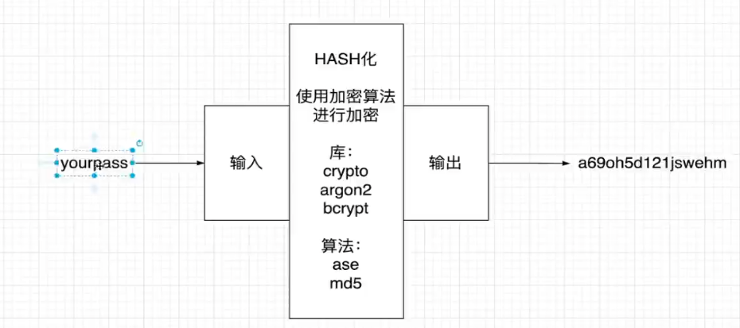

## 密码加密 



### argon2使用

- [argon2](https://www.npmjs.com/package/argon2)

密码哈希加密

```ts
argon2.hash(123123); // $argon2id$v=19$m=65536,t=3,p=4$f2890PnNRChwCZlqbdqOug$MhW3cabykG2P7hswzJlv/M6RQxrU89D0cNz+HL2XJPw
```

密码比对

```ts
argon2.verify(user.password, password);
```