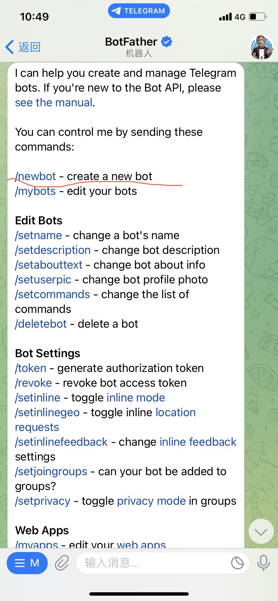
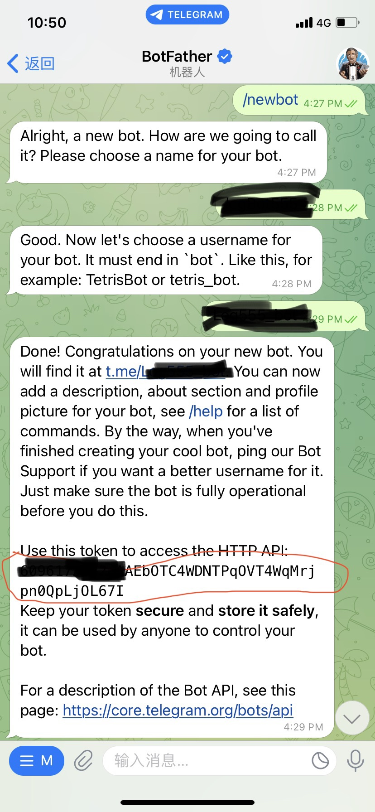

## 安装

- [telegraf](https://www.npmjs.com/package/telegraf?activeTab=readme)

## 流程

### 条件

1. 机器人申请,`telegram`搜索栏搜索<span class="e-1">@botfather</span>(特殊Telegram机器人,控制所有其他的机器人),从这里获取一个机器人令牌




**机器人的名称必须为`bot`结尾**

2. 查看自己`telegram`用户ID,添加<span class="e-1">@userinfobot</span>机器人
3. 查看群组ID,群组中添加<span class="e-1">@get_id_bot</span>机器人,然后输入`/my_id@get_id_bot`即可

## 业务

### 错误日志推送

```javascript
import ...

@Catch()
export class AllExceptionFilter implements ExceptionFilter {
  constructor(
    private readonly logger: LoggerService,
    private readonly configService: ConfigService,
  ) {}

  catch(exception: HttpException, host: ArgumentsHost) {
    const ctx = host.switchToHttp();
    const request = ctx.getRequest();
    const response = ctx.getResponse();

    // http状态码
    const httpStatus =
      exception instanceof HttpException
        ? exception.getStatus()
        : HttpStatus.INTERNAL_SERVER_ERROR;

    const ip = requestIp.getClientIp(request).match(/(\d{1,3}\.){3}\d{1,3}/)[0];

    const message = exception.message
      ? exception.message
      : `${httpStatus >= 500 ? 'Service Error' : 'Client Error'}`;

    /**
     * @title 错误响应数据格式
     */
    const errorResponse = {
      status_Code: httpStatus,
      data: {
        error: message,
      },
      message: 'fail',
      url: request.originalUrl,
      response_time: dayjs().valueOf(),
    };

    /**
     * @title 日志记录数据格式
     */
    const loggerResponseBody = {
      headers: request.headers,
      query: request.query,
      body: request.body,
      timestamp: dayjs().format('YYYY-MM-DDTHH:mm:ss'),
      ip,
      exception: exception['name'],
      error: errorResponse,
    };

    // 设置返回的状态码、请求头、发送错误信息
    response.status(httpStatus);
    response.header('Content-Type', 'application/json; charset=utf-8');
    response.send(errorResponse);

    this.logger.error(loggerResponseBody);

    /**
     * @title Telegram 错误日志推送
     */
    // TODO: 错误过滤
    // 加入更多异常错误逻辑
    // if (exception instanceof QueryFailedError) {
    //   msg = exception.message;
    //   if (exception.driverError.errno === 1062) {
    //     msg = '唯一索引冲突';
    //   }
    // }
    const msg: string = exception['response'] || 'Internal Server Error';

    const bot = new Telegraf(
      this.configService.get(ConfigEnum.TELEGRAM_BOT_TOKEN), // 机器人ID
    );

    bot.telegram.sendMessage(
      this.configService.get(ConfigEnum.TELEGRAM_PUSH_ID), // telegram 推送ID,用户ID或群组ID
      JSON.stringify(
        {
          ip,
          exception: exception['name'],
          errorResponse,
          timestamp: dayjs().format('YYYY-MM-DDTHH:mm:ss'),
        },
        null,
        '\t',
      ),
    );
  }
}
```

## 参考

- [telegraf.js](https://telegraf.js.org/classes/Telegram.html#getChatMember)