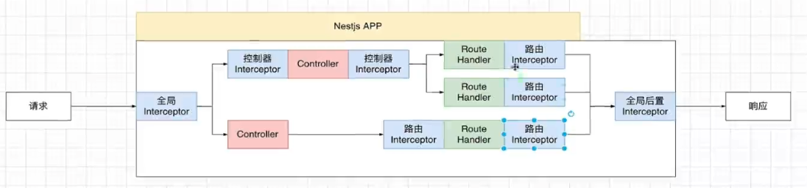

## 图示



## 应用

### 分页拦截器

用于处理响应数据为分页的数据，分页带有分页相关的数据

```javascript
import ...

@Injectable()
export class PaginateInterceptor implements NestInterceptor {
  intercept(context: ExecutionContext, next: CallHandler): Observable<any> {
    return next.handle().pipe(
      map((data) => {
        return {
          list: data.items,
          meta: {
            itemCount: data.items.length,
            totalItems: data.count,
            itemsPerPage: data.take,
            totalPages: Math.ceil(data.count / data.take),
            currentPage: data.skip || 1,
            isNextPage: (data.skip || 1) < Math.ceil(data.count / data.take),
          },
        };
      }),
    );
  }
}
```

### 统一格式返回拦截器

```javascript
import ...

@Injectable()
export class SerializeResponseInterceptor implements NestInterceptor {
  constructor(private readonly logger: LoggerService) {}

  intercept(context: ExecutionContext, next: CallHandler): Observable<any> {
    return next.handle().pipe(
      map((data) => {
        const request = context.switchToHttp().getRequest();
        const response = context.switchToHttp().getResponse();

        const result = {
          status_code: response.statusCode,
          data,
          message: 'success',
          response_time: new Date().getTime(),
        };

        this.logger.log({
          message: 'success',
          headers: request.headers,
          query: request.query,
          body: request.body,
          ip: requestIp.getClientIp(request).match(/(\d{1,3}\.){3}\d{1,3}/)[0],
          api_url: request.originalUrl,
          method: request.method,
        });

        return result;
      }),
    );
  }
}
```

## 错误

## 参考

- [Nest.js 中文文档-拦截器](https://docs.nestjs.cn/9/interceptors)