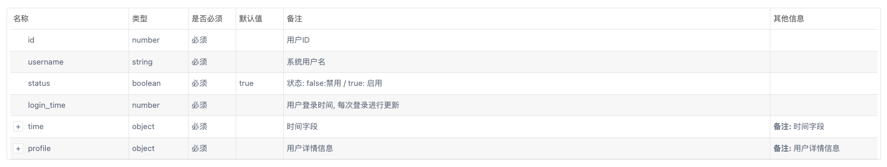
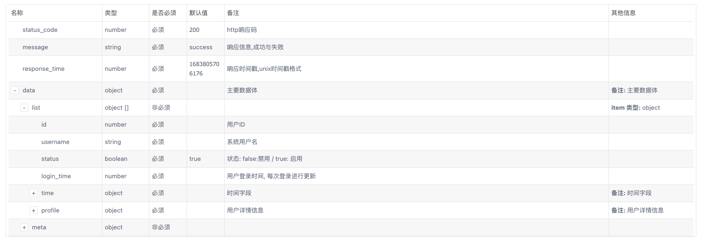

## 场景

- 输出API文档的方案
- 节省编写API文档的时间

## 安装

```shell
$ npm install --save @nestjs/swagger swagger-ui-express
```

## ApiProperty

<span class="e-1">ApiProperty</span>用于设置类的单个属性

```javascript
@ApiProperty({
  description: '字段描述',
  required: false,
  default: '默认值',
})

export class GetSystemUserDTO extends PaginationDTO {
  @ApiProperty({
    description: '用户名',
    // example: 'jacker123',
    required: false,
    default: 'jack123',
  })
  @StringValidator({
    min: 6,
  })
  public username?: string;

  @ApiProperty({
    description: '状态, 0:禁用、1:启用',
    example: true,
    required: false,
  })
  @Transform(({ value }) => toBoolean(value))
  @IsBoolean()
  @IsOptional()
  public status?: boolean;

  @ApiProperty({
    description: '用户昵称',
    example: 'jacker',
    required: false,
  })
  @StringValidator({
    min: 6,
  })
  public nike_name?: string;

  @ApiProperty({
    description: '用户性别,0: 未知、1: 男、2: 女',
    example: 0,
    required: false,
  })
  @NumberValidator()
  @Max(2)
  public gender?: number;

  @ApiProperty({
    description: '用户邮箱',
    example: 'jacker123@gmail.com',
    required: false,
  })
  @StringValidator({
    isEmail: true,
  })
  public email?: string;

  @ApiProperty({
    description: '登录时间,输入unix时间戳',
    example: 12312312312,
    required: false,
  })
  @NumberValidator()
  public login_time?: number;
}
```

## 响应格式

### 常规输出

要为请求指定返回模型，必须创建一个类并使用 `@ApiProperty()` 装饰器注释所有属性。

之后，必须将 Cat 模型与响应装饰器的 type 属性结合使用。

```javascript {19-22}
export class Cat {
  @ApiProperty()
  id: number;

  @ApiProperty()
  name: string;

  @ApiProperty()
  age: number;

  @ApiProperty()
  breed: string;
}

@ApiTags('cats')
@Controller('cats')
export class CatsController {
  @Post()
  @ApiCreatedResponse({
    description: 'The record has been successfully created.',
    type: Cat
  })
  async create(@Body() createCatDto: CreateCatDto): Promise<Cat> {
    return this.catsService.create(createCatDto);
  }
}
```



### 统一格式输出

API接口一般都会有统一格式，方便客户端对数据进行处理,如:

```javascript
class ResultDataDTO<T> {
  status_code: 200,
  message: 'success',
  response_time: 1683861778480,
  data: T
}
```

具体实现:
1. 封装返回类<span class="e-1">ResultDataDTO</span>
2. 封装分页返回类<span class="e-1">ResultPaginationDataDTO</span>,对分页返回数据进行输出<span class="remark-1">(这里需要举一反三,封装需要的类)</span>
3. 编写<span class="e-1">ApiResult</span>装饰器输出`swagger`

`result_data.dto.ts`

```javascript
import { ApiProperty } from '@nestjs/swagger';

/**
 * @title 统一返回类
 * @description 主要输出到 swagger 文档
 */
export class ResultDataDTO {
  constructor(
    status_code = 200,
    message?: string,
    data?: any,
    response_time = 123123123,
  ) {
    this.status_code = status_code;
    this.message = message || 'success';
    this.data = data || null;
    this.response_time = response_time;
  }

  @ApiProperty({
    type: 'number',
    description: 'http响应码',
    required: true,
    default: 200,
  })
  status_code: number;

  @ApiProperty({
    type: 'string',
    description: '响应信息,成功与失败',
    required: true,
    default: 'success',
  })
  message?: string;

  @ApiProperty({
    type: 'number',
    description: '响应时间戳,unix时间戳格式',
    required: true,
    default: 1683805706176,
  })
  response_time: number;

  @ApiProperty({
    description: '主要数据体',
  })
  data?: any;
}

```

`result_pagination_data.dto.ts`

```javascript
import { ApiProperty } from '@nestjs/swagger';

export class ResultPaginationDataDTO {
  @ApiProperty({
    description: '当前数据总条数',
    required: true,
    default: 10,
  })
  itemCount: number;

  @ApiProperty({
    description: '数据总数',
    required: true,
    default: 10,
  })
  totalItems: number;

  @ApiProperty({
    description: '每页请求的数据',
    required: true,
    default: 10,
  })
  itemsPerPage: number;

  @ApiProperty({
    description: '总页数',
    required: true,
    default: 10,
  })
  totalPages: number;

  @ApiProperty({
    description: '当前页码',
    required: true,
    default: 10,
  })
  currentPage: number;

  @ApiProperty({
    description: '是否存在下一页',
    required: true,
    default: true,
  })
  isNextPage: boolean;
}
```

`api_result.decorator.ts`

```javascript
import ....

const baseTypeNames = ['String', 'Number', 'Boolean'];

interface ApiResultOptions {
  isArray?: boolean;
  isPager?: boolean;
}

/**
 * 封装 swagger 返回统一结构
 * 支持复杂类型 {  code, msg, data }
 * @param model 返回的 data 的数据类型
 * @param isArray data 是否是数组
 * @param isPager data 是否为分页数据, true, 则 data 类型为 { list, meta } ,  false 则 data 类型是纯数组
 */
export const ApiResult = <TModel extends Type<any>>(
  model: TModel,
  options: ApiResultOptions = { isArray: false, isPager: false },
) => {
  let items = null;
  if (model && baseTypeNames.includes(model.name)) {
    items = { type: model.name.toLocaleLowerCase() };
  } else {
    items = { $ref: getSchemaPath(model) };
  }
  let prop = null;
  if (options.isArray && options.isPager) {
    prop = {
      type: 'object',
      properties: {
        list: {
          type: 'array',
          items,
        },
        meta: { $ref: getSchemaPath(ResultPaginationDataDTO) },
      },
    };
  } else if (options.isArray) {
    prop = {
      type: 'array',
      items,
    };
  } else if (model) {
    prop = items;
  } else {
    prop = { type: 'null', default: null };
  }
  return applyDecorators(
    ApiExtraModels(ResultDataDTO, ResultPaginationDataDTO, model),
    ApiOkResponse({
      schema: {
        allOf: [
          { $ref: getSchemaPath(ResultDataDTO) },
          {
            properties: {
              data: prop,
            },
          },
        ],
      },
    }),
  );
};
```

为了定义其他应由`Swagger`模块检查的模型，需要使用`@ApiExtraModels`装饰器进行注册提供,然后就可以使用`getSchemaPath(ExtraModel)`获取对模型的引用(`$ref`)

---

具体使用

```Typescript{14-17}
import ...

@ApiBearerAuth()
@ApiTags('系统用户模块')
@Controller('systemUser')
@UseInterceptors(ClassSerializerInterceptor)
export class SystemUserController {
  constructor(private readonly systemUserService: SystemUserService) {}

  @ApiOperation({
    summary: '获取系统用户列表',
    description: '获取系统用户列表的描述',
  })
  @ApiResult(SystemUser, {
    isArray: true,
    isPager: true,
  })
  @Get('list')
  @Paginate()
  getSystemUserList(@Query() query: GetSystemUserDTO) {
    return this.systemUserService.findAll(query);
  }

  @Get('profile')
  getSystemUserProfile() {
    return this.systemUserService.getProfile();
  }
}
```



## 部署

## 参考

- [Nest JS Validate Query Paramater and DTOs](https://tkssharma.com/nestjs-playing-with-query-param-dto/)
- [NestJs 返回统一的数据格式](https://juejin.cn/post/7043781859569827848)
- [@nestjs/swagger#ApiOkResponse](https://www.programcreek.com/typescript/?api=%40nestjs%2Fswagger.ApiOkResponse)